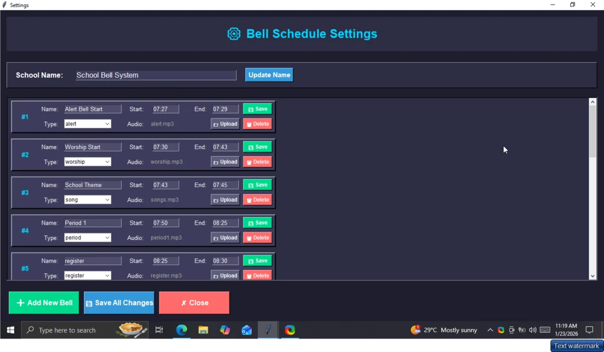
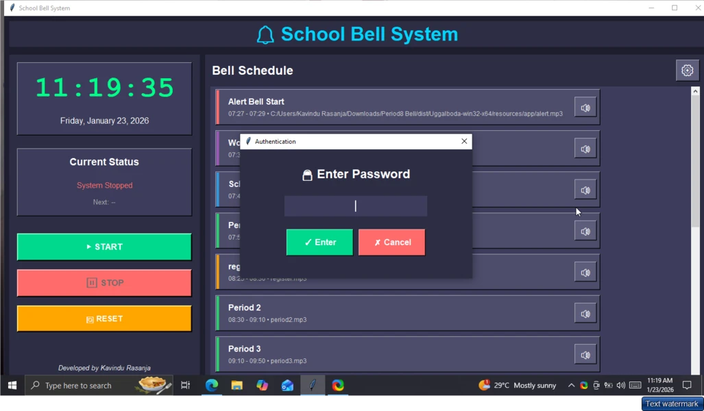
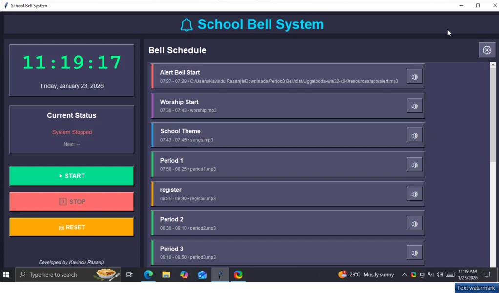

# 🔔 School Bell System

### Automated bell-management software for schools and institutes

A practical Windows-oriented solution for running daily school bell schedules automatically while keeping manual control available when needed.

---

## Product Overview

The School Bell System is designed to reduce the need for manually operating bells throughout the school day. Administrators can run a predefined timetable, trigger sounds manually, and use the system offline on a local computer.

This repository is a **product showcase and documentation repository**. The commercial source code is not published here.

## Key Features

- Automatic timetable-based bell scheduling
- Manual bell controls for unscheduled events
- Support for multiple bell and audio events
- Daily school-period workflow
- Offline operation
- Simple operator-friendly interface
- Windows desktop usage
- Suitable for schools, institutes and tuition environments

## Screenshots

  
  
  

## Designed For

- Primary and secondary schools
- Private institutes
- Tuition centers
- Organizations that need scheduled audio alerts

## Delivery

The production application is distributed separately as commercial software. This public repository intentionally contains only showcase material and documentation.

## Contact

For a product demo, licensing or software-development inquiries:

**Kavindu Rasanja**  
Email: [rasanjakavindu54@gmail.com](mailto:rasanjakavindu54@gmail.com)

---

> Commercial software showcase. Source code is not included in this public repository.
